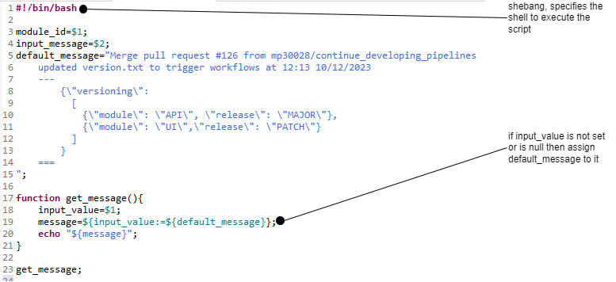
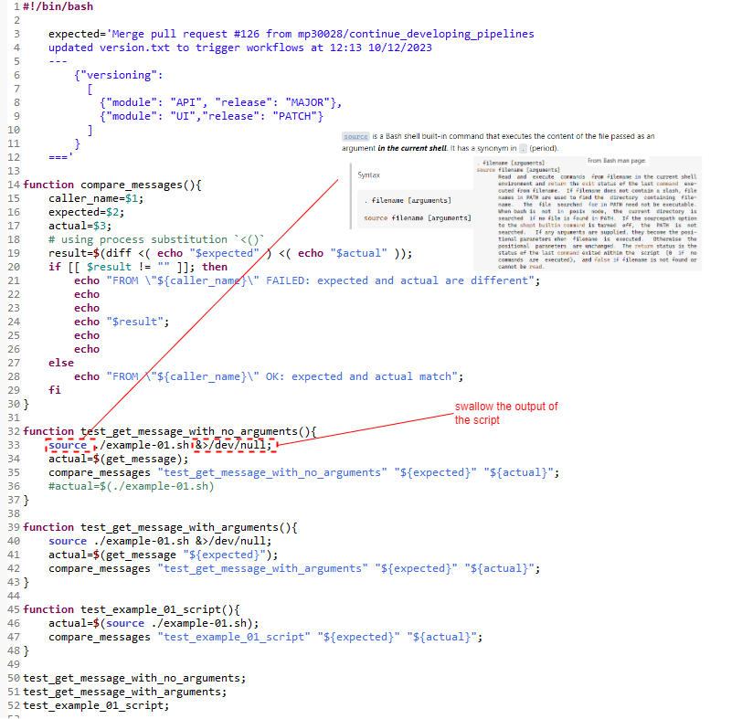
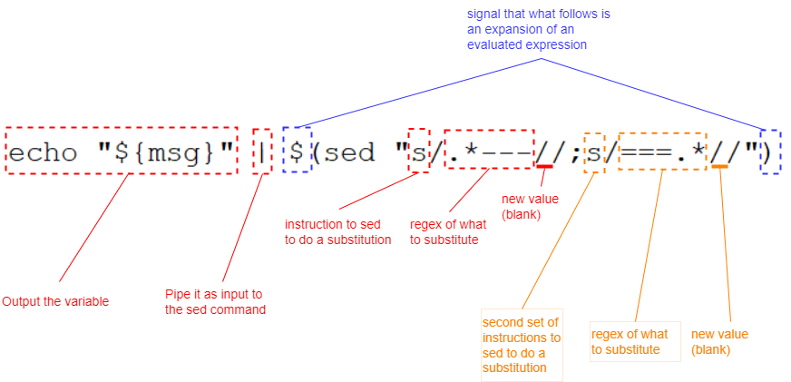

### PARAMETER EXPANSION
see [Linux-command-reference Pg.52](file:G:/docs/books/Linux-command-reference.pdf)

The  $  character introduces parameter expansion, command substitution, or arithmetic expansion. 

#### Testing Script

#### Extracting json delimited within some text using sed
Note the starting delimiter is `---` and the ending delimiter is `===` 
